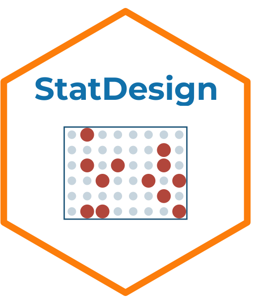

# StatDesign 

> Herramienta interactiva para el diseño de estudios y muestreo en ciencias
> ambientales y recursos naturales.

Parte de la suite **StatSuite**:

| App | Descripción | Estado |
|-----|-------------|--------|
| [StatFlow](https://github.com/ManuelSpinola/StatFlow) | Primeros análisis y visualización de datos | ✅ Disponible |
| **StatDesign** | Diseño de estudios y muestreo | ✅ Disponible |
| StatModels | Modelos estadísticos avanzados | 🔜 Próximamente |

## Módulos

- **📚 Tipos de estudio** — Descriptivo, observacional/correlacional y experimental, con ejemplos del área ambiental.
- **📐 Diseños de muestreo** — Probabilísticos, no probabilísticos y espaciales, más calculadora de tamaño de muestra.
- **🧭 Asistente de diseño** — Wizard de 3 preguntas que recomienda el tipo de estudio según el objetivo de investigación.
- **❓ Ayuda** — Conceptos clave y referencias bibliográficas.

## Estructura del proyecto

```
StatDesign/
├── app.R
├── DESCRIPTION
├── R/
│   └── helpers.R
└── modules/
    ├── mod_tipos.R
    ├── mod_muestreo.R
    ├── mod_asistente.R
    └── mod_ayuda.R
```

## Instalación local

```r
install.packages(c(
  "shiny", "bslib", "bsicons", "tidyverse", "DT"
))
shiny::runApp()
```

## Autor

**Manuel Spínola**  
ICOMVIS · Universidad Nacional · Costa Rica

## Licencia

MIT
